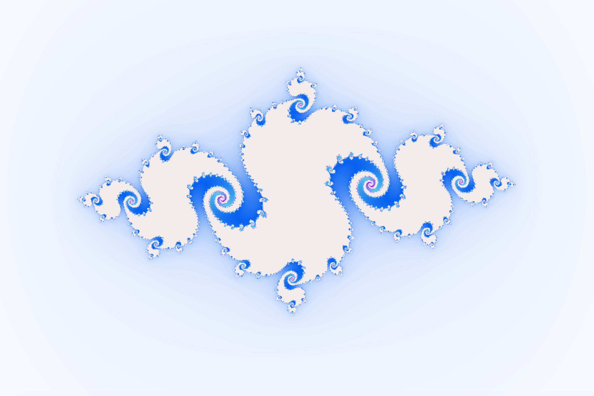
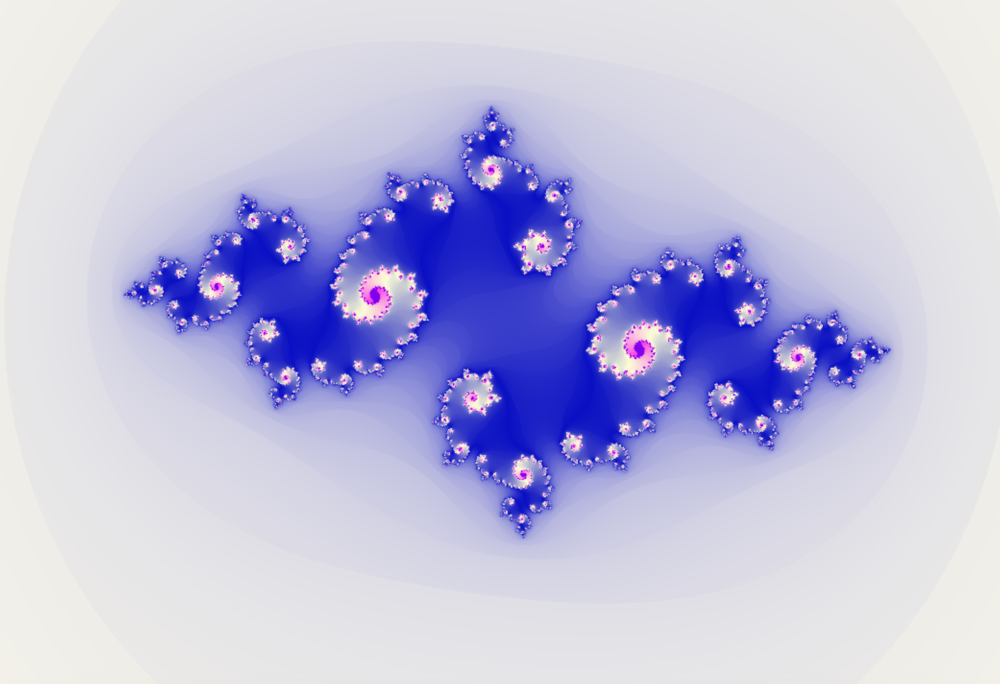
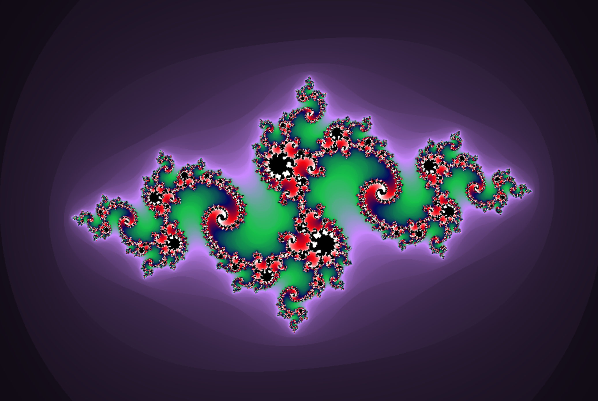
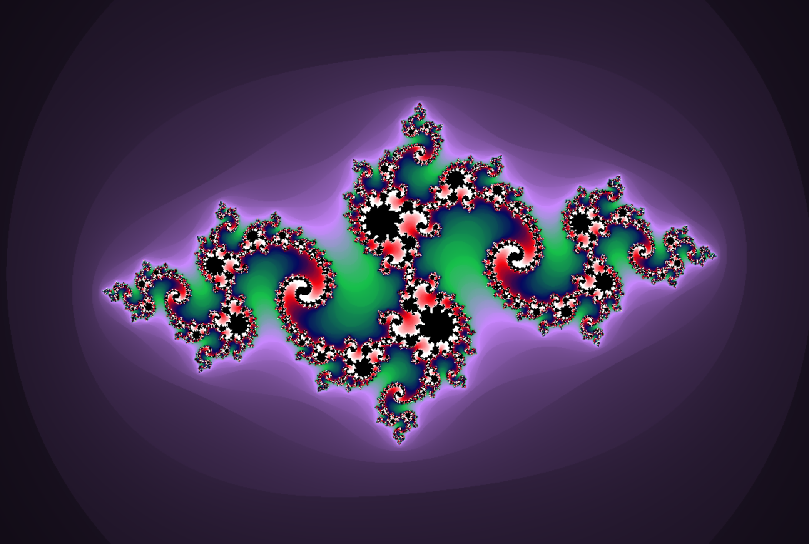
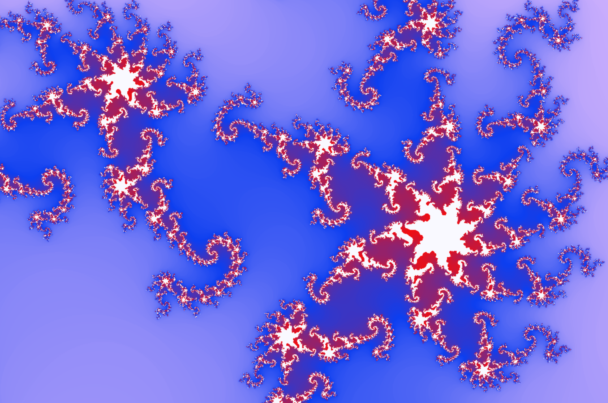
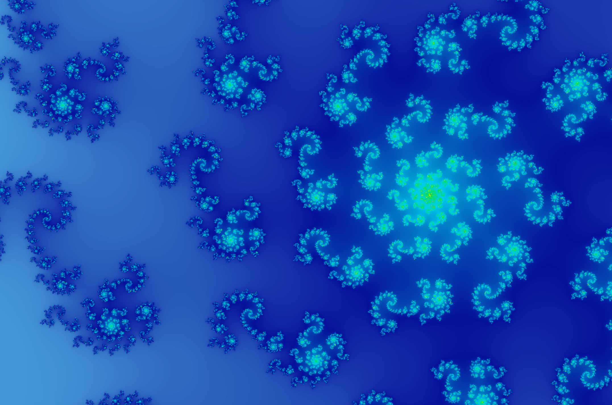

# Fractol - Fractal rendering with mlx
***
## Installation
```
$ git clone https://github.com/LaBoiteDeCarton/fractol.git
$ cd /fractol
$ make
```
***
## Usage
Commande prototype : ./fractol fractalname precision  
fractalname : julia / mandelbrot / mandelbrot2 / mandelbrot3  
precision *unsigned int*: maximum iteration for the complexe sequence  
example  
```
$ ./fractol julia 40
```
***
## Controls
__Basics__   
MOVE : Key Arrows  
FAST MOVE : Shift + Key Arrows  
ZOOM : Mouse Scroll  
ADD PRECISION : Press 'P'  
LESS PRECISIONS : Press ':'  
CHANGE COLORS : Press Tab  
ON/OFF COLOR MENU : Press 'C'  
ON/OFF SMOOTH : Press 'L'  
FIXE THE COMPLEXE VALUE : *only for Julia fractal* Mouse Left Click
***
__Inside the color menu__  
Press 1 to select previous color  
Press 2 to select next color  
Press 3 to add a new color  
HOLD the space bar to select the color inside the fractal  
Move your mouse horizontally to change R value of the color  
Move your mouse vertically to change G value of the color  
Scroll your mouse up and down to change B value of the color  

***
## Screenshots

Here are some examples of the beautiful fractals you can generate with this program:

### Julia Sets


### Julia Set Variations  




### Julia Color Mix




### Zoom Effects - Julia



### Mandelbrot Zoom Series


